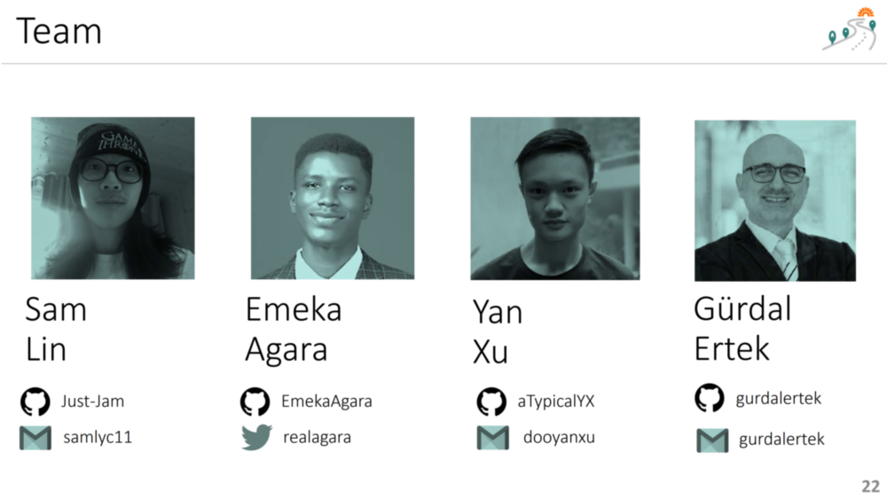

 

## START HERE
- [**Paths2Abundance (P2A) dapp**](https://paths2abundance-nextjs-just-jam.vercel.app/) is running live on the cloud. The dapp requires Hashpack wallet connection for full functionality.
- [**Documentation**](https://github.com/Just-Jam/Paths2Abundance-nextjs/blob/main/doc/Documentation.md) describes the project and the dapp in extensive detail.
- [**Database Design**](https://github.com/Just-Jam/Paths2Abundance-nextjs/blob/main/doc/Database.md) is presented, to serve as a template for future NGO projects in the future, to run under Hedera Hashgraph.
- [**Slide Deck [pdf]**](https://github.com/Just-Jam/Paths2Abundance-nextjs/blob/main/doc/other/Paths2Abundance_Slide_Deck_v05g.pdf) compactly presents the project.
- [**YouTube Video**](https://youtu.be/9bSamwXdDNc) is the demo video for the hackathon.

### Paths2Abundance (P2A) Main Window


### Project Team

Our team consists of professionals from varying backgrounds, united with the ethos of **creating value through innovation**.

 


## Setup: Getting Started

This is a [Next.js](https://nextjs.org/) project bootstrapped with [`create-next-app`](https://github.com/vercel/next.js/tree/canary/packages/create-next-app).

First, run the development server:

```bash
npm run dev
# or
yarn dev
```

Open [http://localhost:3000](http://localhost:3000) with your browser to see the result.

You can start editing the page by modifying `pages/index.js`. The page auto-updates as you edit the file.

[API routes](https://nextjs.org/docs/api-routes/introduction) can be accessed on [http://localhost:3000/api/hello](http://localhost:3000/api/hello). This endpoint can be edited in `pages/api/hello.js`.

The `pages/api` directory is mapped to `/api/*`. Files in this directory are treated as [API routes](https://nextjs.org/docs/api-routes/introduction) instead of React pages.

## Learn More

To learn more about Next.js, take a look at the following resources:

- [Next.js Documentation](https://nextjs.org/docs) - learn about Next.js features and API.
- [Learn Next.js](https://nextjs.org/learn) - an interactive Next.js tutorial.

You can check out [the Next.js GitHub repository](https://github.com/vercel/next.js/) - your feedback and contributions are welcome!

## Deploy on Vercel

The easiest way to deploy your Next.js app is to use the [Vercel Platform](https://vercel.com/new?utm_medium=default-template&filter=next.js&utm_source=create-next-app&utm_campaign=create-next-app-readme) from the creators of Next.js.

Check out our [Next.js deployment documentation](https://nextjs.org/docs/deployment) for more details.
