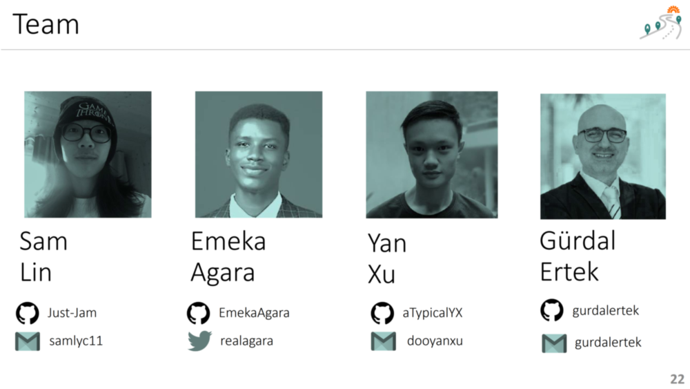

 

### Background

### Inspiration

1. There is immense suffering on earth, much of it being linked to economic, social, and environmental problems.
2. There are amazing innovations and initiatives out there in the world, that aim at alleviating suffering, whether the suffering may be hunger, poverty, disease, or other.
3. Many of the innovations and practical solutions to reduce human suffering are actually practical and actionable. 
4. However, the information regarding these solutions are not presented in an integrated whole, where all the information, metrics, and methods of applying the solution are presented together.
5. In our digital+real hybrid lives, we regularly encounter interesting and many times useful ideas and solutions in viral videos, social media content, social media and video recommendations,  advertisements, viral messages in messaging apps, and many other channels. However, these are short-lived impulses, which require us to do detailed search on the idea and do due diligence on whether it is really useful and whether the organizations that implement these solutions are reliable.
6. **There is a need for an integrated platform where donors can donate paths to abundance with minimal effort and with high confidence.**
7. Charity / Social good is a great area of application for blockchain, as blockchain provides the visibility, transperancy, decentrality, and immutability that can enable trust to donors.
8. **Our Paths2Abundance (P2A) project presents a prototype global giving platform, where donors can donate, with confidence and ease, their favorite frugal innovation solution to projects conducted by certified organizations.** 

### Project Team

Our team consists of professionals from varying backgrounds, united with the ethos of **creating value through innovation**.

 

**Index**

1. **Background**
2. [Frugal Innovations](FrugalInnovations.md)
3. [Unique Value Proposition](UniqueValueProposition.md)
4. [System Architecture](SystemArchitecture.md)
5. [Tokenomics](Tokenomics.md)
6. [Database](Database.md)
7. [Frontend](Frontend.md)
9. [Technology/Tool Stack](TechnologyStack.md)
10. [Resources](Resources.md)
11. [Future Work](FuturePlans.md)
12. [Branding](Branding.md)

<hline></hline>

[Back to Main GitHub Page](../README.md) | [Back to Documentation Index Page](Documentation.md)
