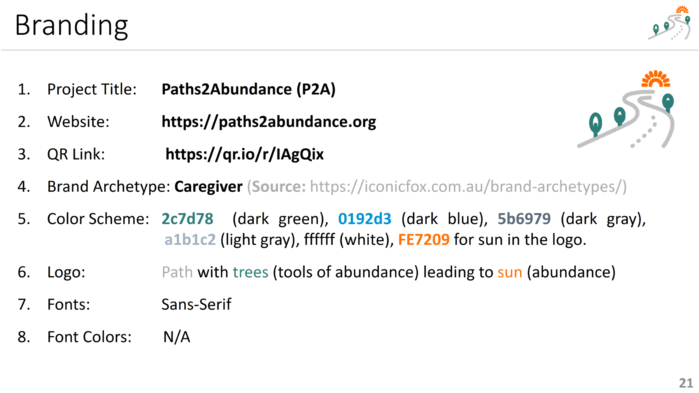

 

## Branding

Paths2Abundance (P2A) is a global charity platform, which aims at helping **communities** around the world **help themselves**, through **frugal innovations.** 

This following figure presents the branding standards for P2A;

 

## Index

1. [Background](Background.md)
2. [Frugal Innovations](FrugalInnovations.md)
3. [Unique Value Proposition](UniqueValueProposition.md)
4. [System Architecture](SystemArchitecture.md)
5. [Tokenomics](Tokenomics.md)
6. [Database](Database.md)
7. [Frontend](Frontend.md)
9. [Technology/Tool Stack](TechnologyStack.md)
10. [Resources](Resources.md)
11. [Future Work](FuturePlans.md)
12. **Branding**

<hline></hline>

[Back to Main GitHub Page](../README.md) | [Back to Documentation Index Page](Documentation.md)
