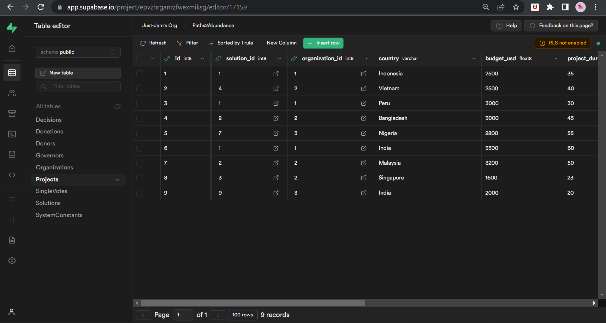
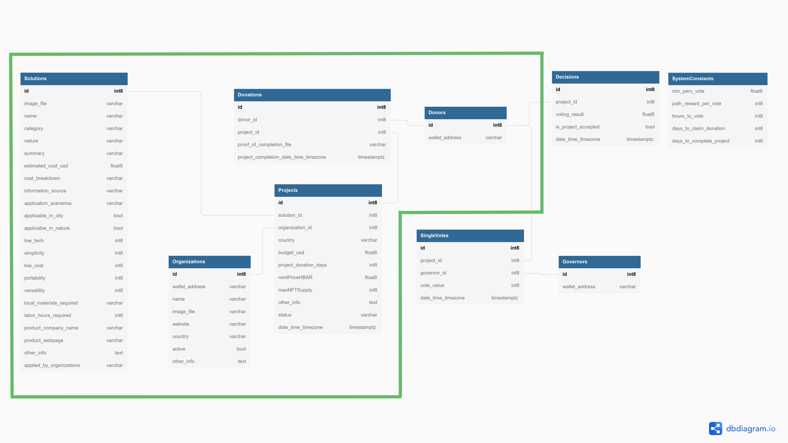
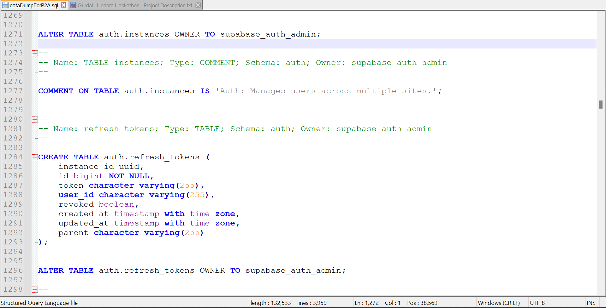

 

## Database

### Database under Supabase
- The database for P2A is stored under [Supabase](https://supabase.com).
- In the following diagram, a screenshot is provided from the `Projects` table in the Supabase database.

 

### Data Schema Diagram

- In the following diagram, all database tables, both currently implemented ones and the future implementations, are presented.
- In the image, the tables in the current implementation for the hackathon are shown with green border. 
- The remaining tables, mainly related to governance, are basis for future work.
- The diagram is also available as a [pdf download](./other/database_diagram.pdf). 
- The source code for the diagram is available as a [text file with dbml markup content](./other/database_diagram_dbml_code.dbml). 
- The source code for the diagram, colored and printed as pdf, is [available here](./other/database_diagram_dbml_code.pdf). 
- For interactively browsing through the database, and especially seeing the relations between the different tables, please visit the [design under dbdiagram](https://dbdiagram.io/d/62780e117f945876b6d9028e).

 

### Database SQL Dump

- In the following diagram, a screenshot is provided for the SQL dump of the database.
- Full SQL dump of the database, to be imported from PostgreSQL into Supabase, is [available here](./other/dataDumpForP2A.sql) for developers who would like to fork and built upon the project's repo.
- Full SQL dump of the database, colored and printed as pdf, is [available here](./other/dataDumpForP2A.pdf). 

 

**Index**

1. [Background](Background.md)
2. [Frugal Innovations](FrugalInnovations.md)
3. [Unique Value Proposition](UniqueValueProposition.md)
4. [System Architecture](SystemArchitecture.md)
5. [Tokenomics](Tokenomics.md)
6. **Database**
7. [Frontend](Frontend.md)
9. [Technology/Tool Stack](TechnologyStack.md)
10. [Resources](Resources.md)
11. [Future Work](FuturePlans.md)
12. [Branding](Branding.md)

<hline></hline>

[Back to Main GitHub Page](../README.md) | [Back to Documentation Index Page](Documentation.md)
