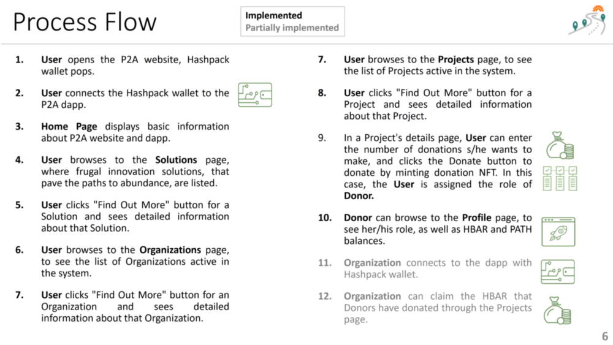

 

## Frontend

### Paths2Abundance (P2A) Main Window

### Process Flow

1. **User** opens the P2A website, Hashpack wallet pops.
2. **User** connects the Hashpack wallet to the P2A dapp.
3. **Home Page** displays basic information about P2A website and dapp. 
4. **User** browses to the **Solutions** page, where frugal innovation solutions, that pave the paths to abundance, are listed.
5. **User** clicks "Find Out More" button for a Solution and sees detailed information about that Solution.
6. **User** browses to the **Organizations** page, to see the list of Organizations active in the system.
7. **User** clicks "Find Out More" button for an Organization and sees detailed information about that Organization.
8. **User** browses to the **Projects** page, to see the list of Projects active in the system.
9. **User** clicks "Find Out More" button for a Project and sees detailed information about that Project.
10. In a Project's details page, **User** can enter the number of donations s/he wants to make, and clicks the Donate button to donate to the project. In this case, the **User** is assigned the role of **Donor**.
11. **Donor** can browse to the **Profile** page, to see her/his role, as well as HBAR and PATH balances.
12. **Organization** connects to the dapp with wallet
13. **Organization** can claim the HBAR that Donors have donated through the Projects page.

 

### Solutions Page
 

### Solution Details Page
 

### Organizations Page
 

### Organization Details Page
 

### Projects Page
 

### Project Details & Donation Page
 

## Design Principles

When designing the **dapp**, [DDP: Decentralisation Design Principles](https://github.com/thisisbullish/ddp) by [thisisbullish](https://github.com/thisisbullish) was taken as a guiding source. 

When designing the **user interface (UI)**, the [Gestalt Principles](https://www.interaction-design.org/literature/topics/gestalt-principles) of School of [M. Wertheimer (Wertheimer, 2020)](https://link.springer.com/book/10.1007/978-3-030-36063-4) and the knowledge visualization guidelines of [Eppler and Burkhard (2008)](https://www.igi-global.com/chapter/knowledge-visualization/25136) were applied. 

In **coding** the system, best effort was done to adhere to some of the [best practices of coding](https://code.tutsplus.com/tutorials/top-15-best-practices-for-writing-super-readable-code--net-8118).

**Index**

1. [Background](Background.md)
2. [Frugal Innovations](FrugalInnovations.md)
3. [Unique Value Proposition](UniqueValueProposition.md)
4. [System Architecture](SystemArchitecture.md)
5. [Tokenomics](Tokenomics.md)
6. [Database](Database.md)
7. **Frontend**
9. [Technology/Tool Stack](TechnologyStack.md)
10. [Resources](Resources.md)
11. [Future Work](FuturePlans.md)
12. [Branding](Branding.md)

<hline></hline>

[Back to Main GitHub Page](../README.md) | [Back to Documentation Index Page](Documentation.md)
