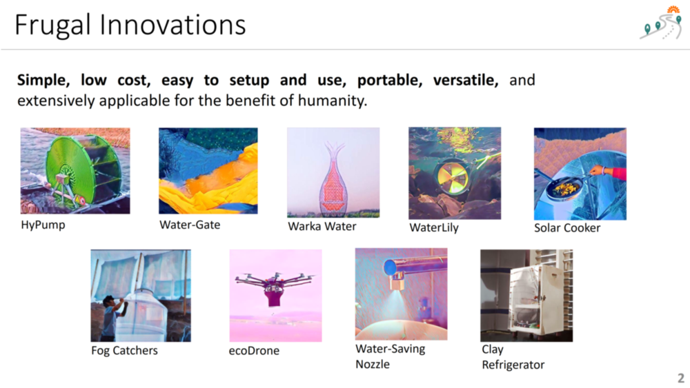
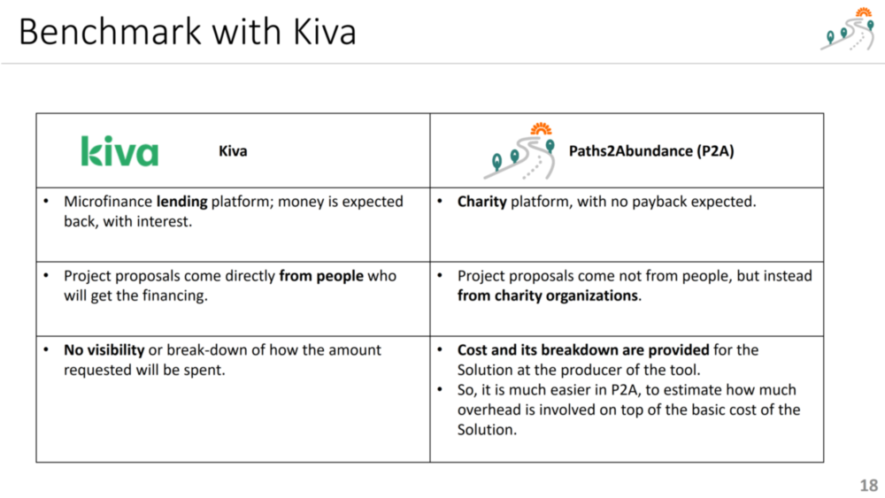

 

## Frugal Innovations

### Paths2Abundance (P2A) and Frugal Innovations

1. Paths2Abundance (P2A) is a global charity platform, which aims at helping **communities** around the world **help themselves**, through **frugal innovations.** 
2. Rather than donating direct consumables, such as food, the platform enables donors to pave the paths to abundance through **donation of solutions**, in the form of **tools, equipment, materials, methods,** and **information** that will help those in need to help themselves. 
3. All the solutions in the dapp are **"frugal innovations,"** meaning that they are **simple, low cost, easy to setup and use, portable, versatile, and  extensively applicable** for the benefit of humanity. 
4. The goal of P2A is **elevating humanity** through paving paths to abundance. This is done with **frugal innovations** and value creation ecosystems.

### Examples of Frugal Innovations
 

### Criteria for "Frugal Innovation" Solution

1. **Low Tech** (Is the system low tech, requiring only low tech ingredients, materials, and methods?)
2. **Simplicity** (Is the system simple to understand, set up, and use, with minimal instructions?)
3. **Low Cost**  (Affordability, compared to standard systems that provide the same solution, is the system cheaper?)
4. **Portability** (Can the innovation easily be transported to even remote places and carried by humans manually?)
5. **Versatility** (Can the innovation be used in a wide geography or under restricted geographical or climatic conditions?)

### CategoryOfSolution >> Possible Values for Solution/Innovation Categories

1. **Water** (simple solutions to generate, clean, or sanitize water, Adam Danyal channel has videos for many such innovations, priority is given to solutions related to water, as water is root of many other problems, as explained in Matt Damon and Gary White interview with Lewis Howes <https://www.youtube.com/watch?v=Po0unQn6fLg> )
2. **Energy** (cheap, low cost, mobile, low tech, portable solutions to generate electricity or other forms of energy, such as portable water generators)
3. **Food** (plants fruits vegetables that can grow easily, equipment -such as zero electricity refrigerator- to preserve food, solutions that enable keeping food during transport, ex: <https://www.youtube.com/watch?v=7vvCF3TZ9GE> portable cooker)
4. **Soil** (solutions and methods that protect the soil, prevent erosion)
5. **Forest** (solutions that help grow trees, such as drones that plant many seeds, such as <https://www.youtube.com/watch?v=byFrZ1T3EHI>)
6. **Economy** (simple solutions, apparatus, methods, or materials that can enable economic value creation, including simple business ideas, main source being [kiva.org](https://kiva.org) and microfinance websites)
7. **Recycle** (solutions that transform waste into usable materials)
8. **Health** (solutions that protect, nurture, improve health)

### NatureOfSolution >> Possible Values for Nature of Solution

1. **Generating** 
   (ex: generating water from air  <https://youtu.be/YxRONAZoMDk>, generating trees using drones <https://youtu.be/byFrZ1T3EHI> )
2. **Saving** 
   (ex: sink faucet nozzle that saves water <https://youtu.be/AWRxhbKWvZk>)
3. **Cleaning** 
   (ex: tiles that lock up air pollution <https://youtu.be/Tfelw7C4V0k> )
4. **Transforming** 
   (ex: mushrooms turned into bacon and styrofoam <https://youtu.be/uznXI8wrdag> )
5. **Transporting** 
   (ex: drones to transport medicine <https://youtu.be/AWtIybYU-20>) 
6. **Storing** 
   (ex: zero-electricity frigde made out of clay <https://youtu.be/WPYzV64dUuU>)
7. **Controlling** 
   (ex: Water-Gate to control water flow during flood <https://youtu.be/arZbmV9vqug> )

### Why "Frugal Innovations"?
Why are we targeting for "frugal innovations"? For example, we do not want "prefabricated house" as a solution. We want much simpler, cheaper solutions.
1. Frugal innovations, due to low budgeting requirements, are easier to **fund quickly.**
2. With small-budget donations, **project completion cycle becomes shorter.**
3. With shorter life cycles, **testing the feasibility of a Solution is faster.** 
4. **Risk is smaller** when one starts small. If small projects with a Solution or of an Organization is successful, risk is less for bigger projects.
5. **Frugal innovations punch well above their weight.** A small investment into a frugal innovation can generate big benefits sustainably over the long run.

### Benchmark with Kiva
**Kiva** <https://kiva.org> is one of the most well-known charity platforms in the world. Here is how P2A benchmarks against Kiva:

1. **Kiva** <https://kiva.org> is a microfinance lending platform (money is expected back, with interest)
https://www.google.com/search?channel=trow5&client=firefox-b-d&q=microfinance+nobel+winner
On the other hand, **P2A** is a charity platform, with no payback expected.
2. In **Kiva,** the project proposals come directly from people who will get the financing. In **P2A,** the proposals come not from people, but instead from charity organizations.
3. In **Kiva,** there is no visibility or break-down of how the amount requested will be spent. 
For example, in the following project, <https://www.kiva.org/lend-beta/2363732> , the donor does not know why the donee asks for 1050 USD for building a pump and how she will spend the fund. In **P2A,** the cost and its breakdown are provided for the Solution at the producer of the Solution. So, it is much easier in P2A to estimate how much overhead is involved on top of the basic cost of the Solution.

### Benchmark with Kiva - Comparison Table
 

### Benchmark with Other Blockchain Projects
To the best of our knowledge, P2A is to be the first platform of its kind in the blockchain world. While [Energy Web Foundation](https://www.energyweb.org/) has a [similar project](https://medium.com/energy-web-insights/how-energy-web-and-engie-energy-access-leverage-crypto-to-expand-solar-energy-access-in-faec75354e45), where donors can donate solar systems, their project is limited to only a single solution category (solar systems), whereas our system allows for all types of solutions in all dimensions of sustainability.

**Index**

1. [Background](Background.md)
2. **Frugal Innovations**
3. [Unique Value Proposition](UniqueValueProposition.md)
4. [System Architecture](SystemArchitecture.md)
5. [Tokenomics](Tokenomics.md)
6. [Database](Database.md)
7. [Frontend](Frontend.md)
9. [Technology/Tool Stack](TechnologyStack.md)
10. [Resources](Resources.md)
11. [Future Work](FuturePlans.md)
12. [Branding](Branding.md)

<hline></hline>

[Back to Main GitHub Page](../README.md) | [Back to Documentation Index Page](Documentation.md)
