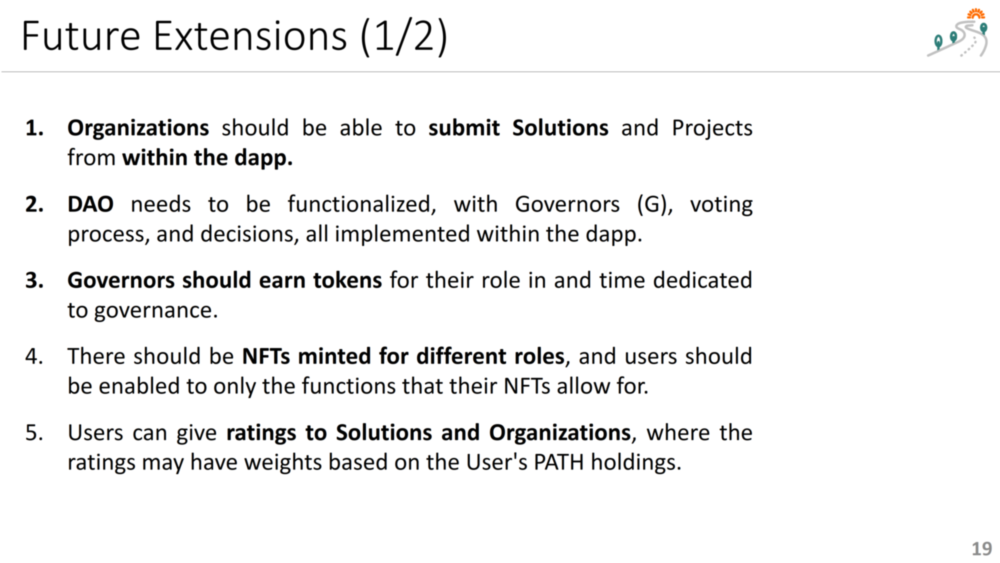
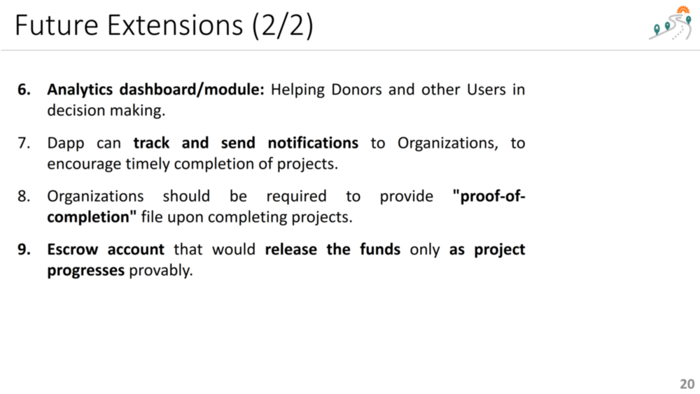

 

## Future of Paths2Abundance (P2A)

### Future Work
 
 

1. Currently, to submit a Solution or Project, the Organizations need to contact the Developer Team, who then manually enter the information into the database. Certainly, this is not sustainable. We readily have form designs so that Organizations can submit Solutions and Projects, and they can be approved/rejected from within the system, either by the Developer Team, or, in the future, by a DAO.
2. In the future version of the platform, a DAO needs to be functionalized, with Governors (G), voting process, and decisions, all implemented within the dapp. Currently, the database design includes the tables for a DAO, however, the functionality is not yet there in the dapp.
3. Just like Donors are earning PATH tokens for their donations, Governors should earn tokens for their role in and time dedicated to governance. 
4. In the current implementation, the role of the connected wallet (Organization or Donor) is deducted by reading data from a centralized database under Supabase. This is not ideal. There should be NFTs minted for different roles, and users should be enabled to only the functions that their NFTs allow for.
5. As a future enhancement, Users can give ratings to Solutions and Organizations, where the ratings may have weights based on the User's PATH holdings.
6. Through a future implementation of an analytics dashboard/module, Donors and other Users can view statistics / analytics for different Solutions/Projects/Organizations, helping them with their donation decisions.
7. Project information states a project duration during which a project must be completed. However, currently, this functionality is not implemented. In the future, the dapp can track, and maybe even send notifications to Organizations, to encourage timely completion of projects. There can even be a credit rating system that gives ratings to Organizations.
8. In a realistic scenario, Organizations should be required to provide detailed project information on the completion of the projects for which they received donation. The "proof-of-completion" file can include cost breakdown, receipts, photos, videos of project execution, and recorded video testimonials. 
9. There can be an escrow account, that would release the funds only as project progresses provably. In other words, the project may have interim deliverables, proven through interim "proof-of-progress" files submitted at project milestones. If a project fails, the donors should either be refunded or given the option to extend the deadline.
10. [Formal contractual documents](https://www.wonder.legal/us/modele/donation-agreement), can be created for the donations as pdf file and be made part of the donation NFT, with data automatically filled in for the particular transaction.
11. With respect to documentation, [automated code documentation tools](https://solidity-domain-for-sphinx.readthedocs.io/en/latest/autodoc.html) can be used to obtain detailed documentation for smart contracts and other code collections.

### Future Possibilities for Tokenomics
1. Donors can gain PATH tokens as they make donations. The exchange rate can be changed to X PATH for every 1 HBAR that they donate. 
2. Governors’ weight in decision making can depend on the PATH tokens they hold, as a monotonically increasing function, with the formula Weight = SQRT(x), where x is the amount of PATH tokens the Governor holds.
3. Governor NFTs can be automatically minted for Donors who reach a certain number of PATH tokens.

### Extending the Solutions Collection
The solutions collection within P2A can be extended by researching many other sources of frugal innovations. Here are some sources for Solution Ideas:

1. <https://www.youtube.com/c/adamdanyal>
2. <https://www.youtube.com/results?search_query=frugal+innovation+examples>
3. <https://www.youtube.com/results?search_query=sustainable+technology+africa>
4. Videos that display under the YouTube hashtag #worldwidewaste 
5. Other favorites from the project team:
   5.1. generating trees using drones <https://youtu.be/byFrZ1T3EHI>
   5.2. sink faucet nozzle that saves water <https://youtu.be/AWRxhbKWvZk>
   5.3. drones to transport medicine <https://youtu.be/AWtIybYU-20>
   5.4. zero-electricity frigde made out of clay <https://youtu.be/WPYzV64dUuU>
6. Some new solutions:
   6.1. <https://www.youtube.com/watch?v=RZHcmzOJdqU> 
   6.2. <https://youtu.be/KlUQ1pneow8> 
   6.3. <https://www.amazon.ae/s?k=water+purification+tablets&crid=PGDTZMBT39MN&sprefix=water+purification+tablets%2Caps%2C173&ref=nb_sb_noss_1> 

**Index**

1. [Background](Background.md)
2. [Frugal Innovations](FrugalInnovations.md)
3. [Unique Value Proposition](UniqueValueProposition.md)
4. [System Architecture](SystemArchitecture.md)
5. [Tokenomics](Tokenomics.md)
6. [Database](Database.md)
7. [Frontend](Frontend.md)
9. [Technology/Tool Stack](TechnologyStack.md)
10. [Resources](Resources.md)
11. **Future Work**
12. [Branding](Branding.md)

<hline></hline>

[Back to Main GitHub Page](../README.md) | [Back to Documentation Index Page](Documentation.md)
