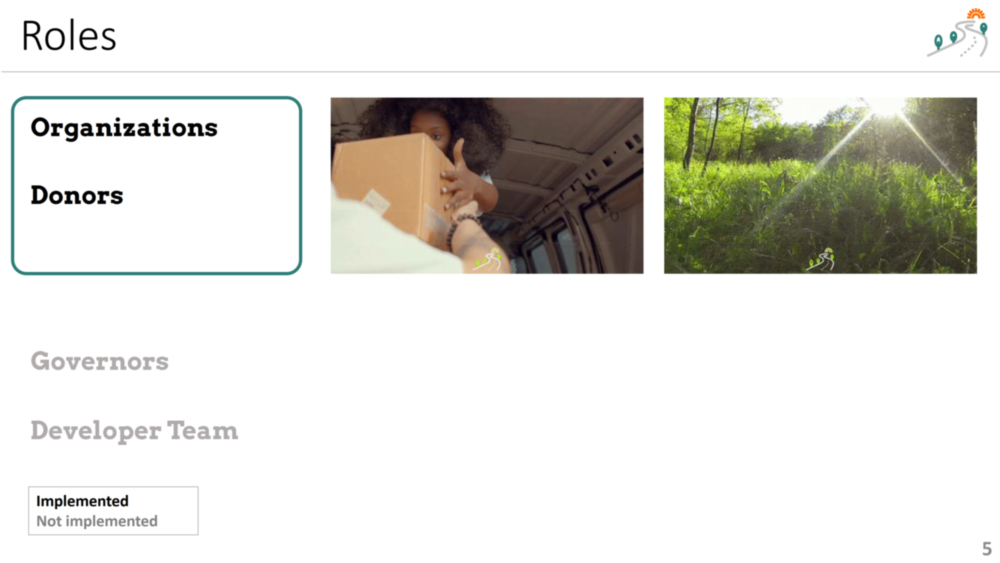
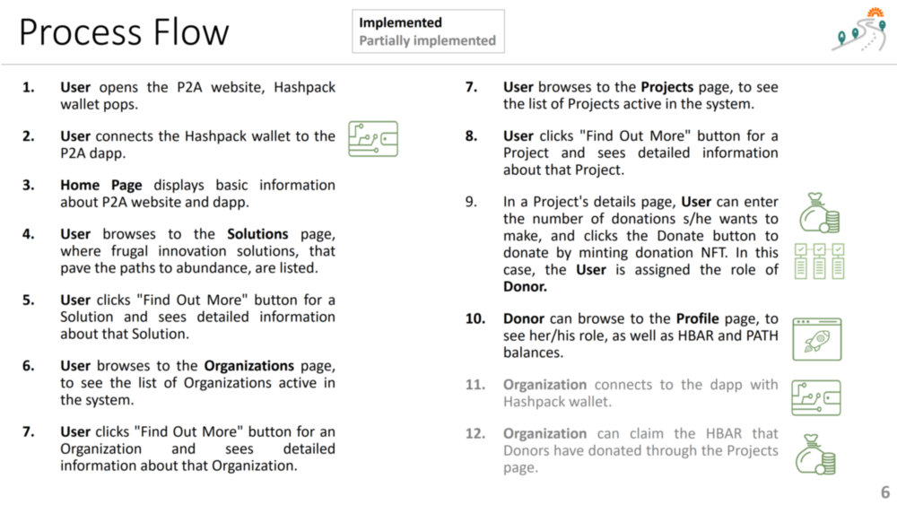

 

## System Architecture

The participants into the platform are illustrated in the following figure:

 

### Elements of and Agents in the System

1. **Solution** (can be submitted by the anyone using the system, and especially by Organization, Governor, or the Developer Team)
2. **Organization** (submits Solutions and Projects)
3. **Project**  (Organization, Solution, Location/Community combination waiting to be sponsored)
4. **Donor** (will donate HBAR for the approved Projects)
5. [Future Work] **Governor** (does due diligance on the Organizations, Solutions, and Projects, submitting recommendation for approval/rejection)
6. **Developer** (developers of the P2A website, dapp, which handle technical and content)

## Process Flow
The process flow in the dapp is illustrated in the following figure:

 

**Index**

1. [Background](Background.md)
2. [Frugal Innovations](FrugalInnovations.md)
3. [Unique Value Proposition](UniqueValueProposition.md)
4. **System Architecture**
5. [Tokenomics](Tokenomics.md)
6. [Database](Database.md)
7. [Frontend](Frontend.md)
9. [Technology/Tool Stack](TechnologyStack.md)
10. [Resources](Resources.md)
11. [Future Work](FuturePlans.md)
12. [Branding](Branding.md)

<hline></hline>

[Back to Main GitHub Page](../README.md) | [Back to Documentation Index Page](Documentation.md)
